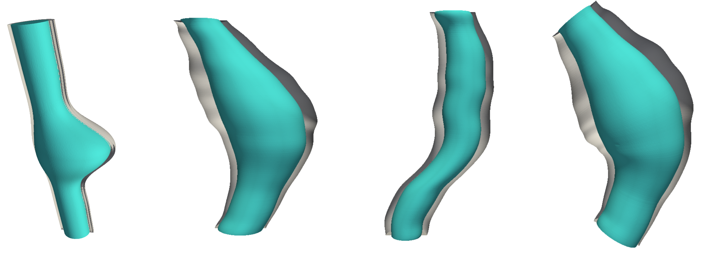

# Aneupy

<i>Aneupy<i> is an open-source software tool designed to generate both idealized and patient-specific geometries of abdominal aortic aneurysms (AAA). It utilizes the Python interface of the [SALOME platform](https://www.salome-platform.org/) to provide versatile geometry creation options suitable for research and educational purposes. Aneupy provides versatile options for creating detailed geometrical models suitable for a variety of computational analyses.


### Simulation-Ready Geometries

Aneupy not only facilitates the generation of AAA geometries but also ensures that the output is ready for various simulation types:

- **Fluid and Solid Domain Preparation**: Generates distinct geometries suitable for fluid dynamics analyses, structural mechanics, or fluid-structure interaction (FSI) simulations.
- **Multiple Export Formats**: Supports exporting geometries in .IGES, .STEP, and .STL formats, providing compatibility with a wide range of FEA (Finite Element Analysis), CFD (Computational Fluid Dynamics), and FSI simulation software.
- **Optimized for Analysis**: Geometries are prepared with considerations for computational efficiency and accuracy, ensuring that they are ready to be integrated into simulation workflows without additional preprocessing.

## Features

Aneupy offers three main functionalities:

1. **Idealized Manual Geometry Generation (`Idealized_manual.py`)**:
   - Allows users to manually input the cross sections (XYZ locations) and radii to generate idealized AAA geometries.

2. **Idealized Automatic Geometry Generation (`Idealized_automatic.py`)**:
   - Streamlines the geometry creation process using parameters defined in `Params_Idealized_Automatic.json`, including length, radii, and wall thicknesses. This method is ideal for simulations where standard geometrical parameters are needed. This script simplifies the creation of idealized geometries by utilizing predefined parameters:
      - `length`: Total length of the aneurysm
      - `radius_nondilated`: Non-dilated radius of the aneurysm
      - `radius_dilated`: Radius of the aneurysm sac
      - `wall_thickness_intima`: Wall thickness of the intima
      - `wall_thickness_media`: Wall thickness of the media
      - `wall_thickness_adventitia`: Wall thickness of the adventitia
      - `wall_thickness_ILT`: Wall thickness of the intraluminal thrombus (ILT)
      - `x_shift`: Assymetry of the AAA sac in the X-direction
      - `y_shift`: Assymetry of the AAA sac in the Y-direction

4. **Patient-Specific Geometry Generation (`Patient_specific.py`)**:
   - Generates geometries from patient-specific data derived from centerlines, wall area, and length measurements of the AAA, with the option to include thrombus area if available. This method allows for high fidelity modeling of individual anatomical features which can be critical in patient-specific simulation studies.

## Installation

Before you can use Aneupy, ensure that your system meets the following prerequisites:

### Prerequisites

1. **Python 3**:
   - Aneupy requires Python 3. Ensure you have Python 3 installed on your system. You can download Python 3 from the [official Python website](https://www.python.org/downloads/).
   - To verify Python is installed, run the following command in your terminal or command prompt:
     ```bash
     python --version
     # or
     python3 --version
     ```
     Ensure that the output indicates a Python 3 version.

2. **SALOME**:
   - Aneupy utilizes the SALOME platform for geometric modeling. Install SALOME version 9.11.0 or newer. You can download it from the [SALOME website](https://www.salome-platform.org/?page_id=2430).
   - Follow the installation instructions provided on the SALOME website to ensure it is correctly installed on your system.

### Installing Aneupy

Once you have the prerequisites installed, you can install Aneupy by cloning its repository:

```bash
git clone https://github.com/mdeluci/aneupy.git
cd aneupy
```

## Setting Up the Environment

Before running the Aneupy scripts, make sure that the paths to Python and SALOME are correctly exported in each of the shell script files you will use. Each shell script is configured to run a specific Python script within the SALOME environment:

- `Run_Idealized_Manual.sh`
- `Run_Idealized_Automatic.sh`
- `Run_Patient_Specific.sh`

Edit these files to ensure that they correctly point to the locations where Python and SALOME are installed on your system. This typically involves setting or modifying the `PATH`, `PYTHONPATH`, and `LD_LIBRARY_PATH` environment variables within these scripts.

## Execution

To run the Aneupy scripts, navigate to the test directory containing your cloned repository and execute the appropriate shell script for the task you want to perform. You can run the scripts directly from the command line.

### Running the Idealized Manual Geometry Script

```bash
./Run_Idealized_Manual.sh
```
this script does not require any additional parameters and will execute with predefined settings. It will produce .IGES, .STL and .STEP files for the solid and fluid domain of the aneurysm.

### Running the Idealized Automatic Geometry Script

You have two options for running the Idealized Automatic script:

 - Manually inputting the parameters: `./Run_Idealized_Automatic.sh --length 120 --radius_nondilated 3 --radius_dilated 8 --wall_thickness_intima 0.5 --wall_thickness_media 0.3 --wall_thickness_adventitia 0.7 --wall_thickness_ILT 2 --x_shift 1.5 --y_shift 2.0`
 - Using a configuration file: `./Run_Idealized_Automatic.sh --config_file ./Params_Idealized_Automatic.json`

### Running the Patient-Specific Geometry Script

The Patient-Specific script allows for the generation of geometries based on detailed patient-specific data. This script is highly configurable, enabling the use of preloaded datasets or custom data placed in the data directory according to the script settings.

#### Configurable Options

- **Preloaded Data**: You can choose between two preloaded sets of centerlines and corresponding wall and lumen areas. This allows for flexibility in simulating different patient scenarios without needing to source additional data.
- **Section Placement**: The script supports two modes for placing sections:
  - **Z-direction**: Sections are placed along the Z-direction, suitable for more straightforward, aligned geometries.
  - **Tangent to the Centerline**: Sections follow the tangential direction of the centerline, offering a more accurate and patient-specific representation, especially in cases of complex aneurysm paths.

To run the script with these configurations, simply execute the following command:

```bash
./Run_Patient_Specific.sh
```

### Notes and Troubleshooting

It might be helpful to include additional notes or a troubleshooting section to assist users in resolving common issues they might encounter. 

```markdown
## Notes and Troubleshooting

- Ensure that all paths set in the shell scripts accurately reflect your system's configuration.
- If you encounter permission errors, you may need to make the shell scripts executable. You can do this with the command `chmod +x Run_*.sh`.
- For any errors related to Python dependencies or SALOME functionalities, ensure that all required libraries are installed and accessible.
```

[](https://zenodo.org/badge/latestdoi/22895/jacobo-diaz/aneupy)

<a rel="license" href="http://creativecommons.org/licenses/by-nc-nd/4.0/"></a><br />This work is licensed under a <a rel="license" href="http://creativecommons.org/licenses/by-nc-nd/4.0/">Creative Commons Attribution-NonCommercial-NoDerivatives 4.0 International License</a>.
